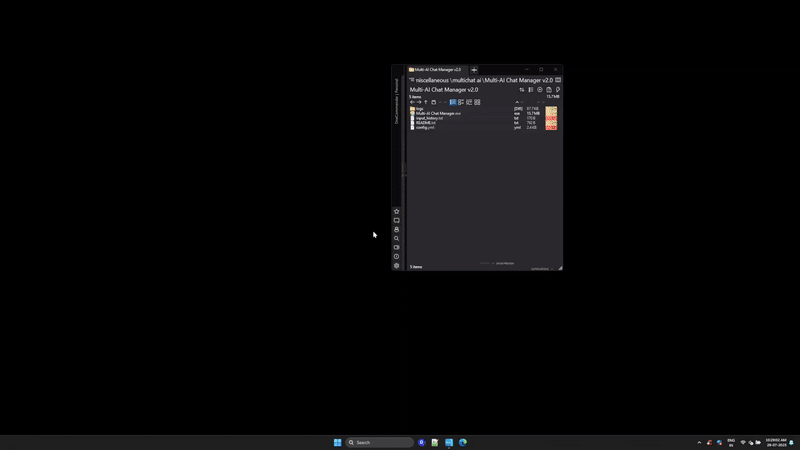
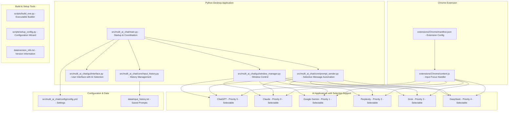
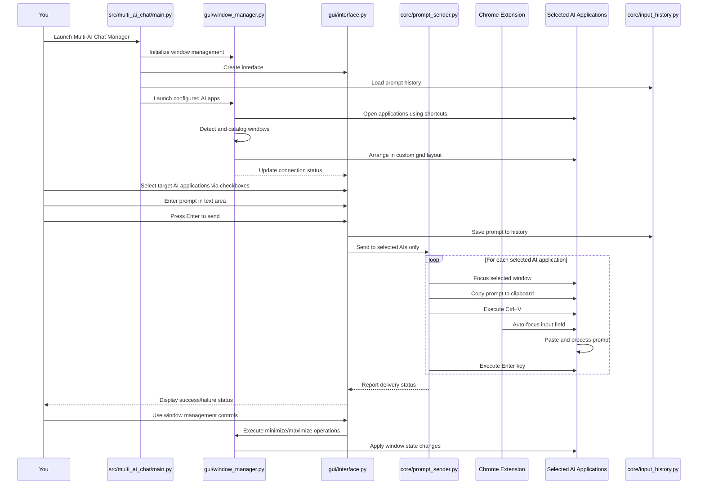
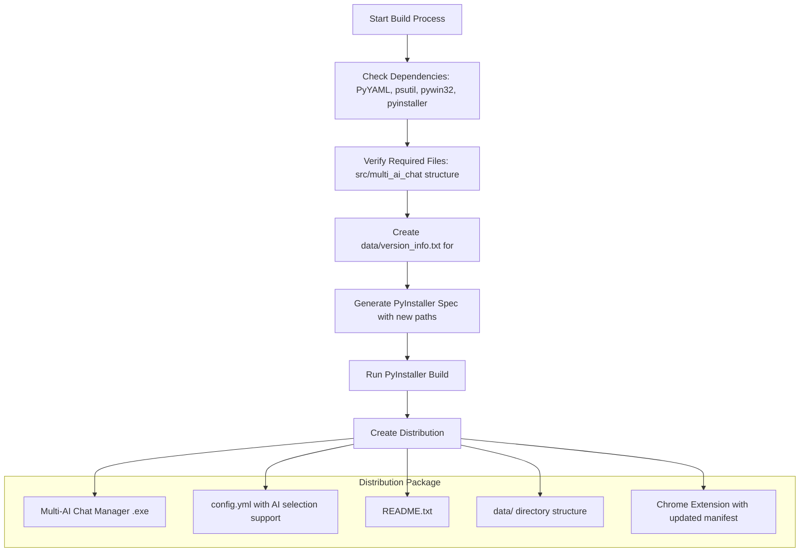
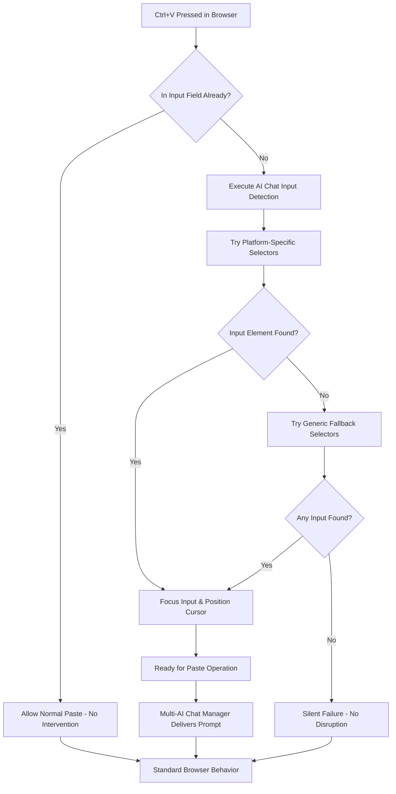
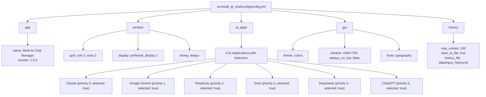

# multi-ai-chat-manager - v1.0.0


[](https://github.com/dhaneshbb/multi-ai-chat-manager/releases)
[](https://github.com/dhaneshbb/multi-ai-chat-manager)
[](https://www.python.org/)
[](LICENSE)


## What This Project Actually Does

Multi-AI Chat Manager solves the common problem of switching between ChatGPT, Claude, Gemini, Perplexity, Grok, and DeepSeek tabs when comparing responses. This Windows application launches your AI chat apps, arranges them in a neat grid on your screen, and lets you send prompts to selected AI applications with one click.

There are two pieces that work together:
1. **The main Python application** - Handles window management and selective message sending
2. **A Chrome extension** - Ensures reliable text pasting into AI chat input fields

## Overview



Multi-AI Chat Manager is a  productivity tool that allows users to send prompts to multiple AI applications simultaneously with selective targeting. The application features a clean, distraction-free interface optimized for  use.

## Key Features

- **Selective AI Targeting**: Choose specific AI applications to receive prompts
- **Interface**: Clean design without distracting elements  
- **Grid Window Management**: Automatic arrangement of AI windows
- **History Management**:  prompt history without navigation clutter
- **Chrome Extension Integration**: Reliable prompt delivery to web-based AIs
- **Multi-Monitor Support**: Configurable display preferences


## Complete Structure

```
Multi-AI Chat Manager /
├── .github/                       
│   ├── ISSUE_TEMPLATE/
│   │   ├── bug_report.md
│   │   └── feature_request.md
│   └── pull_request_template.md      
│
├── doc/                         
│   ├── README.md                
│   ├── Installation.md          
│   ├── Usage.md                 
│   ├── SYSTEM_DIAGRAMS.md  
│   ├── diagrams/                
│   ├── images/                  
│   └── videos/                  
│
├── extensions/                  
│   └── Chrome/
│       ├── manifest.json        
│       ├── content.js           
│       └── README.md            
│
├── scripts/                     
│   ├── build_exe.py             
│   ├── run.bat                  
│   └── setup_config.py          
│
├── src/multi_ai_chat/           
│   ├── main.py                  
│   ├── config/
│   │   └── config.yml           
│   ├── core/                    
│   │   ├── input_history.py     
│   │   └── prompt_sender.py     
│   └── gui/                     
│       ├── interface.py         
│       └── window_manager.py    
│  
├── .gitignore                   
├── CHANGELOG.md                           
├── CONTRIBUTING.md             
├── DISCLAIMER.md               
├── LICENSE                    
├── manifest.json               
├── Readme.md                   
├── requirements.txt                          
└── SECURITY.md                 
```


## System Architecture



## Workflow



## Installation Methods

### Pre-built Executable (Recommended)
1. Download release package
2. Extract to desired location
3. Install Chrome extension
4. Configure AI application shortcuts
5. Run executable

### Source Installation
```bash
# Clone repository
git clone https://github.com/dhaneshbb/multi-ai-chat-manager.git
cd multi-ai-chat-manager

# Install dependencies
pip install -r requirements.txt

# Configure applications
python scripts/setup_config.py

# Install Chrome extension manually

# Run application
python src/multi_ai_chat/main.py
```

## Build and Deployment

### Build Process



### Building Executable
```bash
python scripts/build_exe.py
```

Creates standalone executable with:
- All dependencies bundled
- Configuration files included
-  installer package
- Version information embedded

### Development Setup
```bash
# Create virtual environment
python -m venv venv
venv\Scripts\activate

# Install development dependencies
pip install -r requirements.txt

# Run tests (when available)
python -m pytest tests/

# Run application
python src/multi_ai_chat/main.py
```

### Chrome Extension Integration

The Chrome extension ensures reliable prompt delivery to web-based AI applications:



**Chrome Extension Features:**
- Universal compatibility across all supported AI platforms
- Smart detection of input fields (textarea vs contenteditable)
- SPA support for dynamic page changes
- Non-intrusive operation
-  error handling

## Usage Workflow

### Basic Operation
1. **Launch**: Start Multi-AI Chat Manager
2. **Initialize**: Wait for AI applications to load and arrange
3. **Select**: Choose target AI applications using checkboxes
4. **Prompt**: Enter prompt in main text area
5. **Send**: Press Enter or click send button
6. **Review**: Check responses in arranged AI windows

###  Workflows
- **Comparative Analysis**: Send same prompt to multiple AIs
- **Specialized Tasks**: Target specific AIs for their strengths
- **Batch Processing**: Process multiple prompts efficiently
- **Research Workflows**: Integrate with documentation tools

## Configuration Management

### AI Application Setup
```yaml
ai_apps:
  - name: "Claude"
    shortcut: "C:\\Program Files\\AI Apps\\Claude.lnk"
    keywords: ["claude"]
    enabled: true
    selected: true  # Default selection state
    priority: 0     # Grid position priority
```

### Configuration System Structure



### Display Configuration
```yaml
window:
  grid:
    cols: 3
    rows: 2
  display:
    preferred_display: 1
    use_work_area: true
```

### Timing Optimization
```yaml
window:
  timing:
    launch_delay: 0.1
    load_wait: 2.0
    prompt_send_delay: 0.1
```

## Troubleshooting

### Common Issues
- **AI Detection**: Verify shortcut paths and keywords
- **Prompt Delivery**: Ensure Chrome extension is installed
- **Window Management**: Run as Administrator if needed
- **Performance**: Adjust timing settings for slower systems

### Diagnostic Tools
- Configuration validator: `python scripts/setup_config.py`
- Log analysis: Check `logs/multi_ai_chat.log`
- Chrome extension: Browser console debugging

## Development Notes

### Code Organization

* **Modular Design**: Clear separation of concerns
* **Standards**: Follows PEP 8
* **Error Handling**: Robust exception management
* **Logging**: Detailed operational logs

### Extension Points

* **AI Platforms**: Configurable support
* **Grid Layouts**: Customizable arrangements
* **Themes**: Interface theming
* **Integrations**: External API hooks

## Security Considerations

### Data Privacy
- No data transmission to external servers
- Local storage only
- Configurable history retention
- User-controlled AI selection

### System Integration
- Windows API usage for window management
- Clipboard operations for prompt delivery
- File system access for configuration and logs
- Browser extension with minimal permissions


## License and Disclaimer

**License**: MIT License - Open source  tool

**Disclaimer**: Users are responsible for complying with AI platform Terms of Service. This tool is designed for legitimate research and productivity purposes.

## Support and Community

### Resources
- [Documentation](./doc):
  - [Installation](./doc/Installation.md)
  - [Usage](./doc/Usage.md)
  - [SYSTEM_DIAGRAMS](./doc/SYSTEM_DIAGRAMS.md)

- Example configurations
- Troubleshooting guides
- Video demonstrations

## Contributing

Contributions are welcome! Please read contributing guidelines and submit pull requests to GitHub repository see here [CONTRIBUTING.md](./CONTRIBUTING.md).

---

Multi-AI Chat Manager represents a  approach to AI chat management, focusing on productivity, reliability, and user control while maintaining clean, distraction-free operation.


