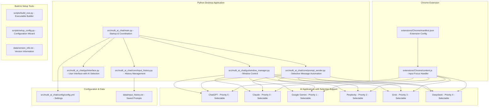
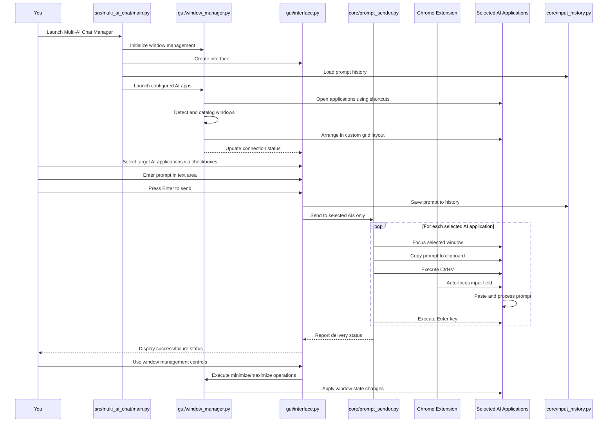
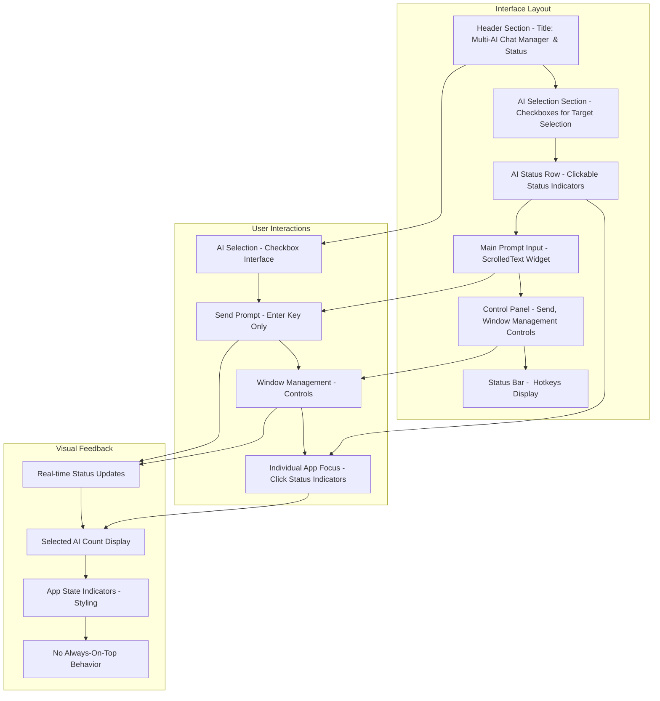
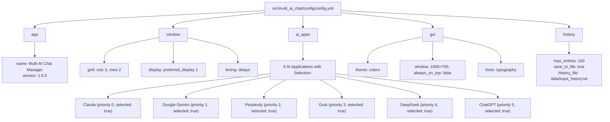
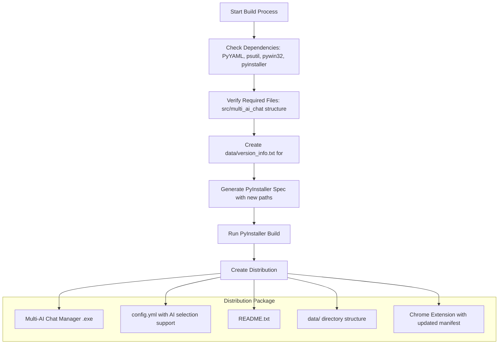
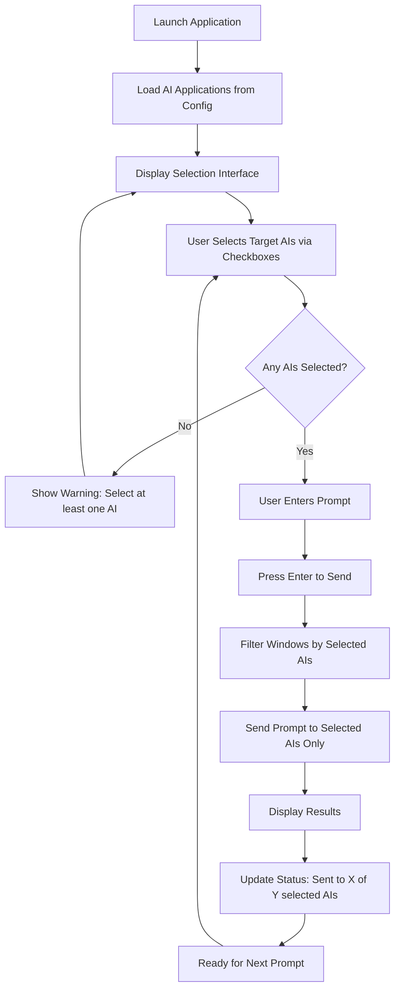
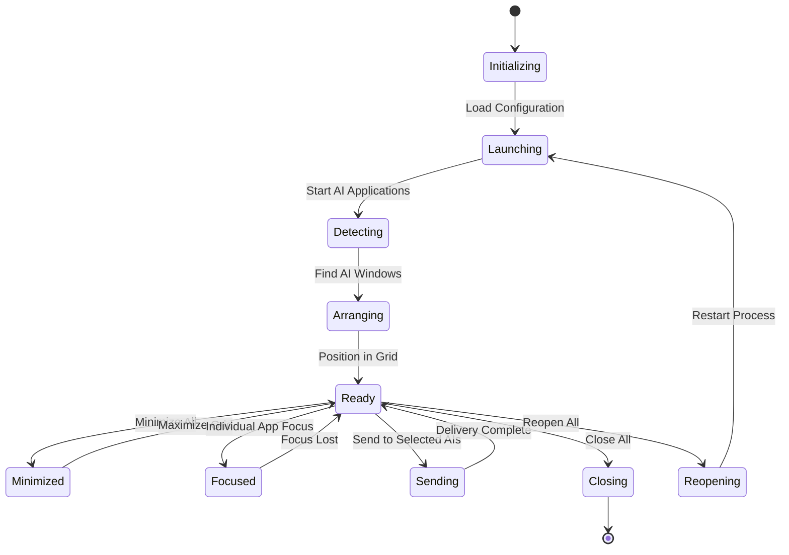
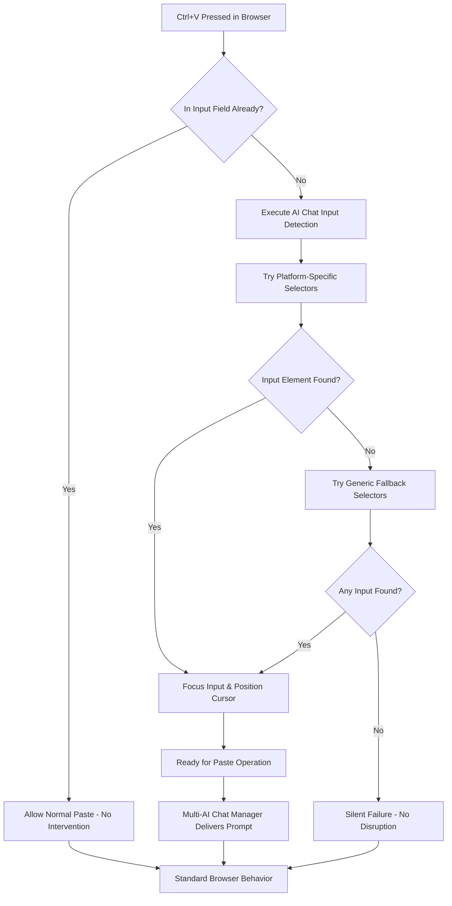

# Multi-AI Chat Manager v1.0.0

## System Architecture

##  Workflow

## GUI Interface Layout 

**Interface Elements:**
- **Normal Window Behavior**: No always-on-top for  use
- **AI Selection Interface**: Checkbox-based targeting system
- **Clean Navigation**: No cursor up/down history navigation
- **Styling**: Dark theme with business-appropriate colors
- **Status Indicators**: Real-time feedback on AI application states

## Configuration System ()

##  Build Process

## AI Selection Workflow

##  Project Structure

```mermaid
graph TD
    A9["Multi-AI Chat Manager /"] --> B9["src/multi_ai_chat/"]
    A9 --> C9["extensions/Chrome/"]
    A9 --> D9["scripts/"]
    A9 --> E9["data/"]
    A9 --> F9["doc/"]
    A9 --> G9["logs/"]
    
    B9 --> B91["main.py -  Entry Point"]
    B9 --> B92["config/config.yml -  Configuration"]
    B9 --> B93["core/ - Core Business Logic"]
    B9 --> B94["gui/ -  Interface"]
    
    B93 --> B931["input_history.py -  History"]
    B93 --> B932["prompt_sender.py - Selective Targeting"]
    
    B94 --> B941["interface.py - AI Selection GUI"]
    B94 --> B942["window_manager.py -  Window Control"]
    
    C9 --> C91["manifest.json -  Extension Config"]
    C9 --> C92["content.js -  Input Focus"]
    C9 --> C93["README.md -  Documentation"]
    
    D9 --> D91["build_exe.py -  Builder"]
    D9 --> D92["setup_config.py - Configuration Wizard"]
    D9 --> D93["run.bat -  Launcher"]
    
    E9 --> E91["input_history.txt -  History Storage"]
    E9 --> E92["version_info.txt - Build Information"]
    
    F9 --> F91["README.md -  Documentation"]
    F9 --> F92["installation.md -  Setup Guide"]
    F9 --> F93["usage.md -  Usage Guide"]
    
    G9 --> G91["multi_ai_chat.log -  Logging"]
```

## Window Management States

## Chrome Extension Integration

##  Use

This tool is designed for  productivity and research purposes. Users are 
responsible for complying with the Terms of Service of each AI platform they use.

---

Multi-AI Chat Manager v1.0.0 -  AI Chat Management Tool