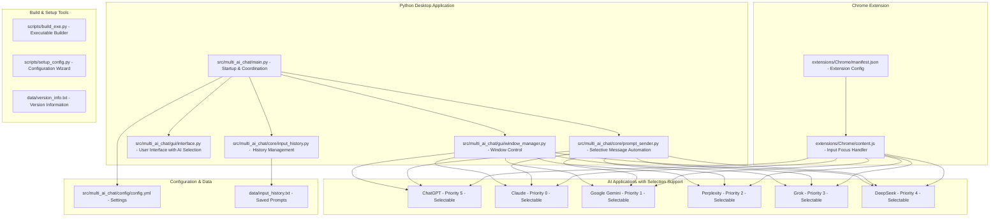
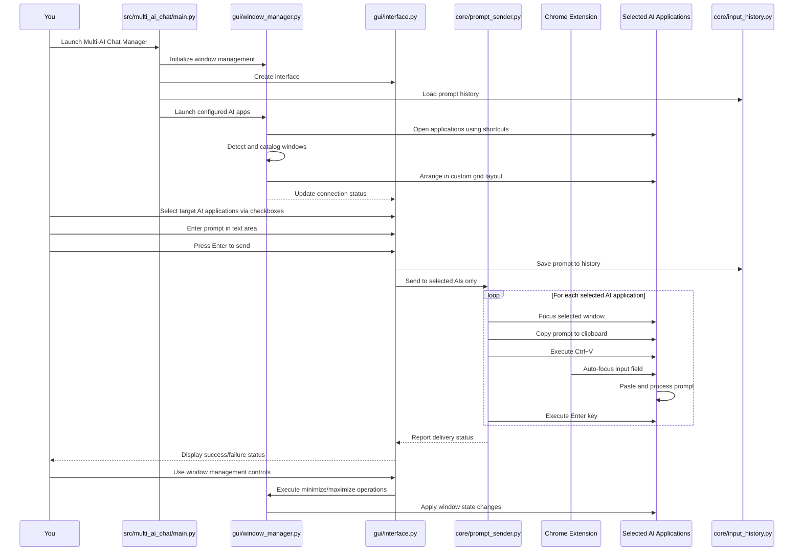
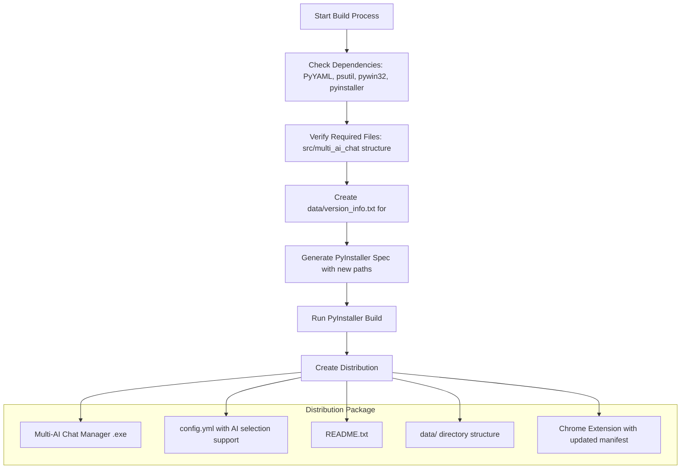
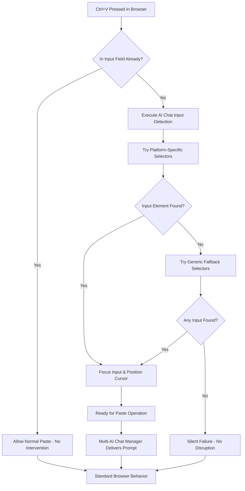
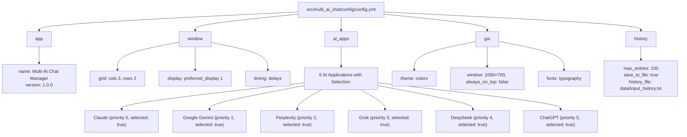

# Multi-AI Chat Manager  - Complete Project Documentation

 AI chat management tool for Windows with selective AI targeting capabilities.

## What This Project Actually Does

Multi-AI Chat Manager solves the common problem of switching between ChatGPT, Claude, Gemini, Perplexity, Grok, and DeepSeek tabs when comparing responses. This Windows application launches your AI chat apps, arranges them in a neat grid on your screen, and lets you send prompts to selected AI applications with one click.

There are two pieces that work together:
1. **The main Python application** - Handles window management and selective message sending
2. **A Chrome extension** - Ensures reliable text pasting into AI chat input fields

## Project Overview

Multi-AI Chat Manager is a  productivity tool that allows users to send prompts to multiple AI applications simultaneously with selective targeting. The application features a clean, distraction-free interface optimized for  use.

## Key Features

- **Selective AI Targeting**: Choose specific AI applications to receive prompts
- **Interface**: Clean design without distracting elements  
- **Grid Window Management**: Automatic arrangement of AI windows
- **History Management**:  prompt history without navigation clutter
- **Chrome Extension Integration**: Reliable prompt delivery to web-based AIs
- **Multi-Monitor Support**: Configurable display preferences

## Project Structure

```
Multi-AI Chat Manager /
├── .github/                       
│   ├── ISSUE_TEMPLATE/
│   │   ├── bug_report.md
│   │   └── feature_request.md
│   └── pull_request_template.md
│
├── data/                        
│   ├── input_history.txt        
│   └── version_info.txt         
│
├── doc/                         
│   ├── README.md                
│   ├── installation.md          
│   ├── usage.md                 
│   ├── documents for github.md  
│   ├── diagrams/                
│   ├── images/                  
│   └── videos/                  
│
├── extensions/                  
│   └── Chrome/
│       ├── manifest.json        
│       ├── content.js           
│       └── README.md            
│
├── logs/                        
│   └── multi_ai_chat.log        
│
├── scripts/                     
│   ├── build_exe.py             
│   ├── run.bat                  
│   └── setup_config.py          
│
├── src/multi_ai_chat/           
│   ├── main.py                  
│   ├── config/
│   │   └── config.yml           
│   ├── core/                    
│   │   ├── input_history.py     
│   │   └── prompt_sender.py     
│   └── gui/                     
│       ├── interface.py         
│       └── window_manager.py    
│
├── tests/                       
├── .gitignore                   
├── CHANGELOG.md                 
├── CODE_OF_CONDUCT.md          
├── CONTRIBUTING.md             
├── DISCLAIMER.md               
├── LICENSE                    
├── manifest.json               
├── readme.md                   
├── requirements.txt            
├── ROADMAP.md                  
└── SECURITY.md                 
```

## System Architecture



## Workflow



## Technical Architecture

### Core Components

**Main Application (`src/multi_ai_chat/main.py`)**
- Application initialization and coordination
- Component integration and startup sequencing
- Configuration loading and validation
- Background AI application management

**User Interface (`src/multi_ai_chat/gui/interface.py`)**
-  tkinter-based GUI
- AI selection checkboxes for targeted prompting
- Clean, distraction-free design
- Real-time status updates and feedback

**Window Manager (`src/multi_ai_chat/gui/window_manager.py`)**
- AI application window detection and control
- Grid-based window arrangement
- Multi-monitor support
- Window state management (minimize/restore)

**Prompt Sender (`src/multi_ai_chat/core/prompt_sender.py`)**
- Clipboard-based prompt distribution
- Windows API integration for reliable automation
- Error handling and recovery
- Support for selective AI targeting

**History Manager (`src/multi_ai_chat/core/input_history.py`)**
-  prompt history management
- File-based persistence
- Search and export capabilities
- Configurable storage limits

### Chrome Extension

**Manifest Configuration (`extensions/Chrome/manifest.json`)**
- Universal AI platform support
- Secure permission model
- Content script injection

**Content Script (`extensions/Chrome/content.js`)**
- Platform-specific input field detection
- Automatic focus management on Ctrl+V
- SPA navigation handling
- Debug logging for troubleshooting

### Configuration System

**Structure (`src/multi_ai_chat/config/config.yml`)**
```yaml
app:
  name: "Multi-AI Chat Manager"
  version: "1.0.0"

window:
  grid: {cols: 3, rows: 2}
  display: {preferred_display: 1}
  timing: {delays and timing settings}

ai_apps:
  - name: "Claude"
    shortcut: "path/to/shortcut.lnk"
    keywords: ["claude"]
    enabled: true
    selected: true
    priority: 0

gui:
  theme: { color scheme}
  window: {size and behavior}
  fonts: {typography settings}

history:
  max_entries: 100
  save_to_file: true
  history_file: "data/input_history.txt"
```

## Supported AI Platforms

- **ChatGPT** (chat.openai.com, chatgpt.com)
- **Claude** (claude.ai)
- **Google Gemini** (gemini.google.com)
- **Perplexity** (perplexity.ai)
- **Grok** (grok.com, x.com/i/grok)
- **DeepSeek** (chat.deepseek.com)
- **Microsoft Copilot** (copilot.microsoft.com)

## Installation Methods

### Pre-built Executable (Recommended)
1. Download release package
2. Extract to desired location
3. Install Chrome extension
4. Configure AI application shortcuts
5. Run executable

### Source Installation
```bash
# Clone repository
git clone https://github.com/dhaneshbb/multi-ai-chat-manager.git
cd multi-ai-chat-manager

# Install dependencies
pip install -r requirements.txt

# Configure applications
python scripts/setup_config.py

# Install Chrome extension manually

# Run application
python src/multi_ai_chat/main.py
```

## Key Features Implementation

### Selective AI Targeting
- Checkbox interface for AI selection
- Runtime targeting without restart
- Persistent selection preferences
- Bulk selection controls (Select All/None)

###  Interface Design
- Removed "always on top" behavior for normal window operation
- Eliminated cursor up/down navigation for cleaner UX
-  color scheme and typography
- Status indicators and real-time feedback

### Grid Window Management
- Configurable grid layouts (3x2 default)
- Priority-based window positioning
- Multi-monitor support
- Minimize/maximize/restore operations

### History Management
- Automatic prompt saving with timestamps
- File-based persistence in `data/input_history.txt`
-  history without navigation clutter
- Export capabilities for workflow integration

## Build and Deployment

### Build Process



### Building Executable
```bash
python scripts/build_exe.py
```

Creates standalone executable with:
- All dependencies bundled
- Configuration files included
-  installer package
- Version information embedded

### Development Setup
```bash
# Create virtual environment
python -m venv venv
venv\Scripts\activate

# Install development dependencies
pip install -r requirements.txt

# Run tests (when available)
python -m pytest tests/

# Run application
python src/multi_ai_chat/main.py
```

### Chrome Extension Integration

The Chrome extension ensures reliable prompt delivery to web-based AI applications:



**Chrome Extension Features:**
- Universal compatibility across all supported AI platforms
- Smart detection of input fields (textarea vs contenteditable)
- SPA support for dynamic page changes
- Non-intrusive operation
-  error handling

## Usage Workflow

### Basic Operation
1. **Launch**: Start Multi-AI Chat Manager
2. **Initialize**: Wait for AI applications to load and arrange
3. **Select**: Choose target AI applications using checkboxes
4. **Prompt**: Enter prompt in main text area
5. **Send**: Press Enter or click send button
6. **Review**: Check responses in arranged AI windows

###  Workflows
- **Comparative Analysis**: Send same prompt to multiple AIs
- **Specialized Tasks**: Target specific AIs for their strengths
- **Batch Processing**: Process multiple prompts efficiently
- **Research Workflows**: Integrate with documentation tools

## Configuration Management

### AI Application Setup
```yaml
ai_apps:
  - name: "Claude"
    shortcut: "C:\\Program Files\\AI Apps\\Claude.lnk"
    keywords: ["claude"]
    enabled: true
    selected: true  # Default selection state
    priority: 0     # Grid position priority
```

### Configuration System Structure



### Display Configuration
```yaml
window:
  grid:
    cols: 3
    rows: 2
  display:
    preferred_display: 1
    use_work_area: true
```

### Timing Optimization
```yaml
window:
  timing:
    launch_delay: 0.1
    load_wait: 2.0
    prompt_send_delay: 0.1
```

## Troubleshooting

### Common Issues
- **AI Detection**: Verify shortcut paths and keywords
- **Prompt Delivery**: Ensure Chrome extension is installed
- **Window Management**: Run as Administrator if needed
- **Performance**: Adjust timing settings for slower systems

### Diagnostic Tools
- Configuration validator: `python scripts/setup_config.py`
- Log analysis: Check `logs/multi_ai_chat.log`
- Chrome extension: Browser console debugging

## Development Notes

### Code Organization
- **Separation of Concerns**: Clear module boundaries
- ** Standards**: PEP 8 compliance
- **Error Handling**: Comprehensive exception management
- **Logging**: Detailed operation logging

### Extension Points
- **AI Platform Support**: Add new platforms via configuration
- **Grid Layouts**: Configurable arrangements
- **Themes**: Customizable interface appearance
- **Integrations**: API hooks for external tools

## Security Considerations

### Data Privacy
- No data transmission to external servers
- Local storage only
- Configurable history retention
- User-controlled AI selection

### System Integration
- Windows API usage for window management
- Clipboard operations for prompt delivery
- File system access for configuration and logs
- Browser extension with minimal permissions

## Future Development

### Planned Features
- Additional AI platform support
- Advanced prompt templating
- Response comparison tools
- Workflow automation
- API integrations

### Architecture Improvements
- Plugin system for AI platforms
- Advanced window management
- Cross-platform support investigation
- Performance optimizations

## Contributing

### Development Setup
1. Fork repository
2. Create feature branch
3. Follow coding standards
4. Add comprehensive tests
5. Update documentation
6. Submit pull request

### Code Standards
- Python PEP 8 compliance
- Comprehensive logging
- Error handling
- Documentation updates
- Version compatibility

## License and Disclaimer

**License**: MIT License - Open source  tool

**Disclaimer**: Users are responsible for complying with AI platform Terms of Service. This tool is designed for legitimate research and productivity purposes.

## Support and Community

### Resources
- Documentation in `doc/` folder
- Example configurations
- Troubleshooting guides
- Video demonstrations

### Community Guidelines
-  communication
- Constructive feedback
- Security-conscious development
- Respect for AI platform policies

---

Multi-AI Chat Manager  represents a  approach to AI chat management, focusing on productivity, reliability, and user control while maintaining clean, distraction-free operation.

## Complete Project Structure

```mermaid
graph TD
    A9["Multi-AI Chat Manager /"] --> B9["src/multi_ai_chat/"]
    A9 --> C9["extensions/Chrome/"]
    A9 --> D9["scripts/"]
    A9 --> E9["data/"]
    A9 --> F9["doc/"]
    A9 --> G9["logs/"]
    
    B9 --> B91["main.py -  Entry Point"]
    B9 --> B92["config/config.yml -  Configuration"]
    B9 --> B93["core/ - Core Business Logic"]
    B9 --> B94["gui/ -  Interface"]
    
    B93 --> B931["input_history.py -  History"]
    B93 --> B932["prompt_sender.py - Selective Targeting"]
    
    B94 --> B941["interface.py - AI Selection GUI"]
    B94 --> B942["window_manager.py -  Window Control"]
    
    C9 --> C91["manifest.json -  Extension Config"]
    C9 --> C92["content.js -  Input Focus"]
    C9 --> C93["README.md -  Documentation"]
    
    D9 --> D91["build_exe.py -  Builder"]
    D9 --> D92["setup_config.py - Configuration Wizard"]
    D9 --> D93["run.bat -  Launcher"]
    
    E9 --> E91["input_history.txt -  History Storage"]
    E9 --> E92["version_info.txt - Build Information"]
    
    F9 --> F91["README.md -  Documentation"]
    F9 --> F92["installation.md -  Setup Guide"]
    F9 --> F93["usage.md -  Usage Guide"]
    
    G9 --> G91["multi_ai_chat.log -  Logging"]
```

