# Multi-AI Chat Manager v2.0

## What This Project Actually Does

Hey! So I got tired of constantly switching between ChatGPT, Claude, Gemini, Perplexity, Grok, and DeepSeek tabs whenever I wanted to compare their responses to the same question. This Windows app basically solves that problem - it launches all your AI chat apps, arranges them in a neat grid on your screen, and lets you send the same prompt to all of them with just one click.

There are two pieces that work together:
1. **The main Python app** - Does all the heavy lifting with window management and sending your messages
2. **A little Chrome extension** - Makes sure your text actually gets pasted into the right chat boxes (trust me, this was needed!)

## Here's How It Actually Works

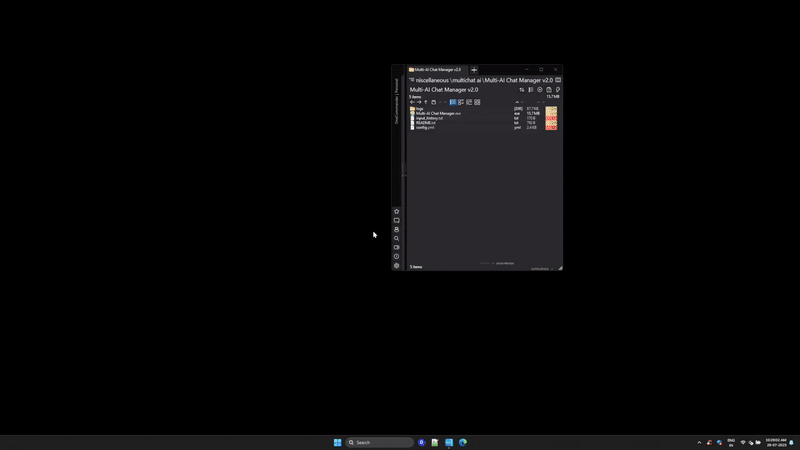

*This GIF shows the whole workflow - I launch the app, it opens and arranges all the AI chat windows automatically, then I type a question once and boom, it goes to all of them. Pretty satisfying to watch, honestly.*

## Complete Project Structure

```
Multi-AI Chat Manager v2.0/
├── main.py                        # Application entry point
├── gui_interface.py               # Main user interface  
├── window_manager.py              # AI window detection & arrangement
├── prompt_sender.py               # Clipboard-based message sending
├── input_history.py               # Prompt history management
├── config.yml                     # Configuration file
├── requirements.txt               # Python dependencies
├── setup.py                       # Python package setup
├── manifest.json                  # Project metadata
├── readme.md                      # Main documentation
├── .gitignore                     # Git ignore patterns
├── LICENSE                        # MIT License
├── CHANGELOG.md                   # Version history
├── CODE_OF_CONDUCT.md             # Community guidelines
├── CONTRIBUTING.md                # Contribution guide
├── DISCLAIMER.md                  # Usage disclaimer
├── ROADMAP.md                     # Future development plans
├── SECURITY.md                    # Security policy
│
├── .github/                       # GitHub templates
│   ├── ISSUE_TEMPLATE/
│   │   ├── bug_report.md
│   │   └── feature_request.md
│   └── pull_request_template.md
│
├── assets/
│   ├── desktop.png
│   ├── video.gif
│   └── diagram.svg
│
├── Chrome Extension/              # Browser extension
│   ├── manifest.json             # Extension configuration
│   └── content.js                # Auto-focus script
│
├── Build Tools/
│   ├── build_exe.py               # Creates standalone executable
│   ├── setup_config.py
│   ├── test_fixes.py
│   └── version_info.txt
```

## System Architecture

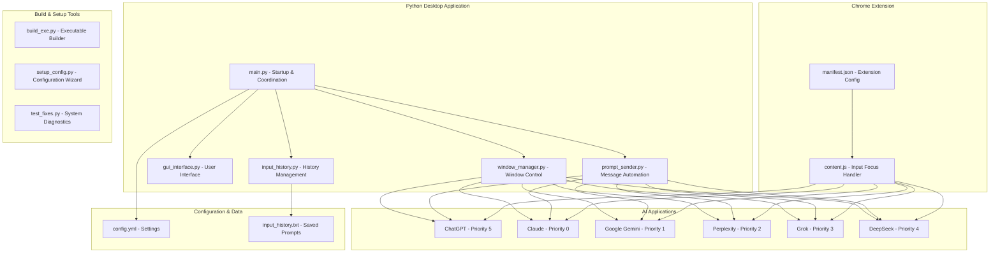

## How I Built This To Work

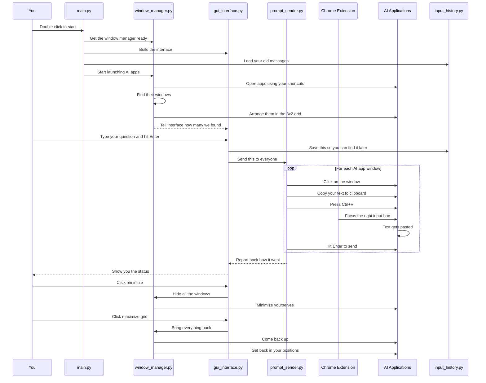

## The Main Parts (What Actually Does What)

### 1. The Startup Process (main.py)

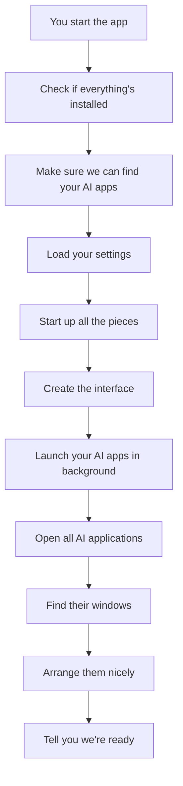

This is where it all begins. I spent way too much time making sure this doesn't crash if something goes wrong - like if one of your AI app shortcuts is broken, it'll just tell you what's up and keep going with the others instead of dying completely.

### 2. Window Manager (window_manager.py)

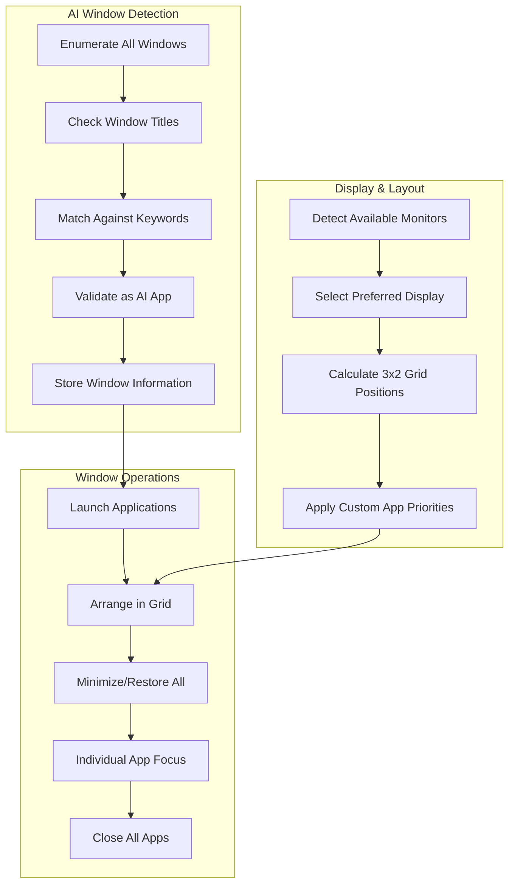

**Custom App Priority Order (from config.yml):**
- Position 0: Claude (priority 0)
- Position 1: Google Gemini (priority 1) 
- Position 2: Perplexity (priority 2)
- Position 3: Grok (priority 3)
- Position 4: DeepSeek (priority 4)
- Position 5: ChatGPT (priority 5)

**Key Features:**
- Multi-monitor support with preferred display selection
- Multiple window positioning methods for reliability
- Taskbar icon management (hide AI apps from taskbar)
- Window state validation and recovery
- Custom grid arrangement based on priority

### 3. GUI Interface (gui_interface.py)

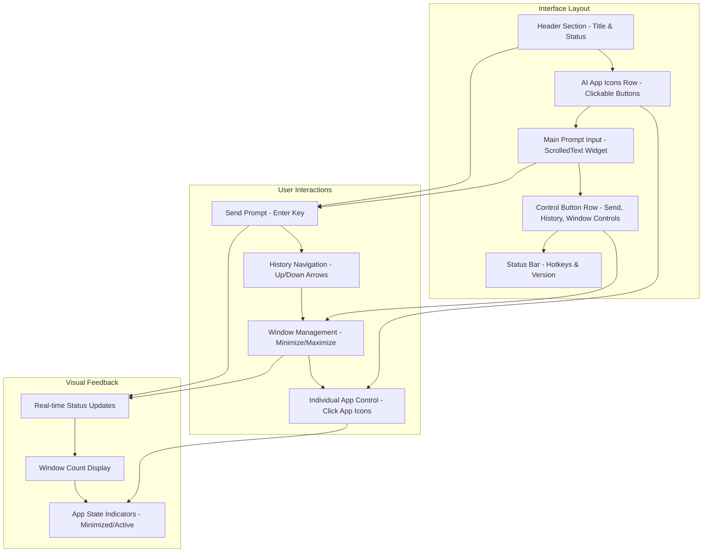

**Interface Elements:**
- **Dark theme** with professional color scheme
- **Always on top** option to stay visible
- **Individual AI app buttons** showing minimized state
- **Keyboard shortcuts** for power users
- **Real-time status updates** with color coding

### 4. Prompt Sender (prompt_sender.py)

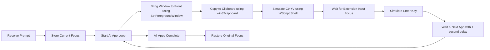

**Technical Implementation:**
- Uses Windows API (win32gui, win32clipboard)
- COM automation via WScript.Shell
- Configurable delays between operations
- Error handling with graceful failure
- Focus restoration to prevent disruption

### 5. Input History (input_history.py)

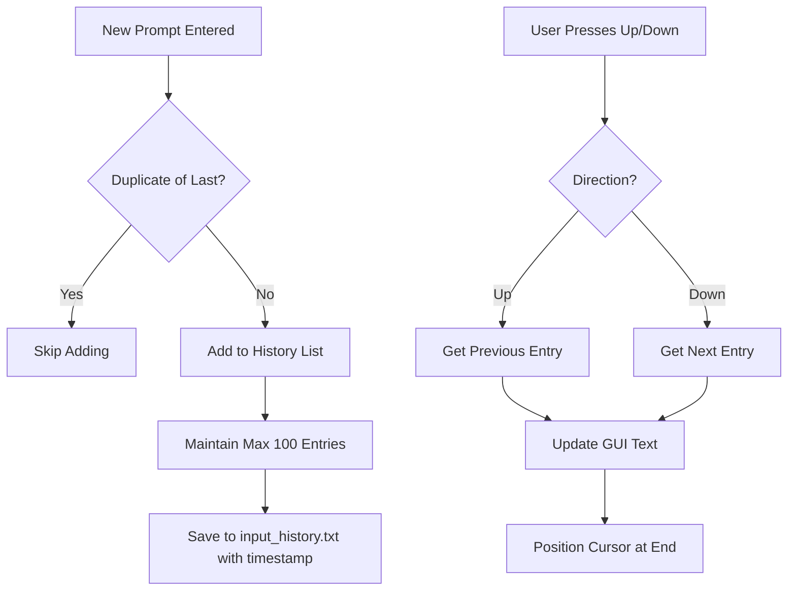

**File Format (input_history.txt):**
```
2025-07-29T09:00:22.141309 | Tell me a random fact, then link it to something surprising.
2025-07-28T18:08:34.151282 | higher index compared to other countries
```

### 6. Chrome Extension (manifest.json + content.js)

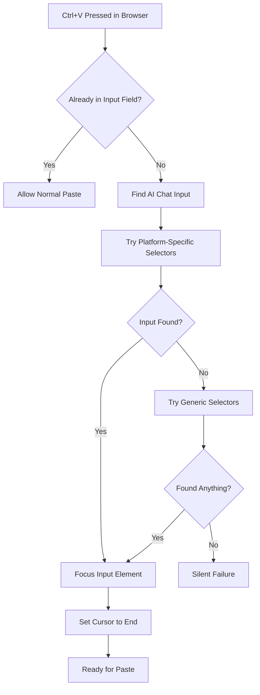

**Platform-Specific Selectors:**
```javascript
// ChatGPT
'#prompt-textarea'
'textarea[data-id="root"]'

// Claude  
'div[contenteditable="true"][data-testid="composer-input"]'

// Gemini
'textarea[placeholder*="Enter a prompt"]'

// Perplexity
'textarea[placeholder*="Ask anything"]'

// Grok
'textarea[placeholder*="Ask Grok"]'

// DeepSeek
'textarea[placeholder*="Send a message"]'
```

**Extension Features:**
- **Universal compatibility** across all major AI platforms
- **Smart detection** of input fields (textarea vs contenteditable)
- **SPA support** handles dynamic page changes
- **Non-intrusive** only activates when needed
- **Debug logging** for troubleshooting

## Configuration System (config.yml)

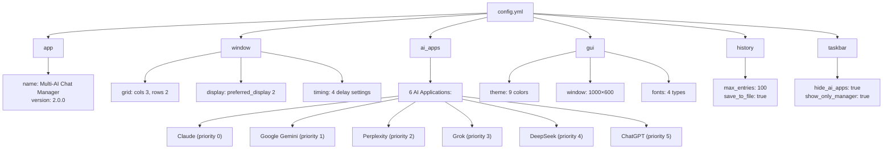

**Grid Layout Visualization (from config.yml):**
```
# Grid Position Layout (3×2):
# Row 1: Claude, Google Gemini, Perplexity  
# Row 2: Grok, DeepSeek, ChatGPT
Display: Monitor 2 (preferred_display: 2)
Window Size: 1000×600 pixels per grid cell

```

**AI Applications Configuration Details:**
```yaml
# Each AI app in the config.yml has this structure:
- name: "Claude"
  shortcut: "C:\\Program Files\\chat_ai\\ai dhaneshbb\\dhaneshbb5_Claude.lnk"
  keywords: ["claude"]
  enabled: true
  priority: 0
```

## Build and Deployment

### Build Process (build_exe.py)

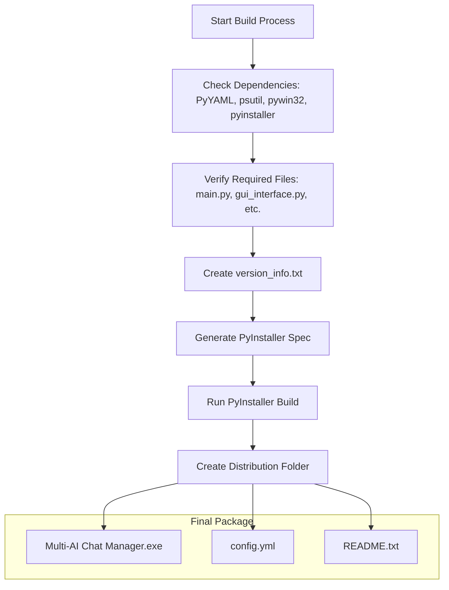

### System Requirements

**For Python Development:**
```
Python 3.8+
PyYAML>=6.0          # Configuration file parsing
psutil>=5.9.0        # Process management
pywin32>=306         # Windows API integration
pyinstaller>=6.0     # Executable building
```

**For End Users:**
- Windows 10/11
- Google Chrome browser
- AI chat applications installed

## Installation Guide

### 1. Download and Setup
```bash
# Clone or download the project
git clone https://github.com/dhaneshbb/multi-ai-chat-manager.git
cd multi-ai-chat-manager

# Install Python dependencies
pip install -r requirements.txt
```

### 2. Install Chrome Extension
1. Open Chrome → `chrome://extensions/`
2. Enable "Developer mode" (top right toggle)
3. Click "Load unpacked"
4. Select the folder containing `manifest.json` and `content.js`
5. Verify extension appears in extensions list

### 3. Configure AI Applications
```bash
# Run interactive configuration
python setup_config.py
```
This will:
- Search for AI app shortcuts automatically
- Let you select which apps to include
- Create/update config.yml with correct paths

### 4. Test System
```bash
# Run diagnostics
python test_fixes.py
```
Checks:
- All dependencies installed
- Config file valid
- Clipboard functionality
- Window detection capabilities
- COM automation working

### 5. Launch Application
```bash
# Run from source
python main.py

# OR build standalone executable
python build_exe.py
```

## Usage Instructions

### Basic Workflow
1. **Launch** the Multi-AI Chat Manager
2. **Wait** for AI applications to start and arrange automatically
3. **Type** your prompt in the main text area
4. **Press Enter** or click "Send to All AI Apps"
5. **Watch** as your prompt appears in all AI chat windows
6. **Compare** responses from different AI models

### Keyboard Shortcuts
- **Enter**: Send prompt to all AI apps
- **Shift+Enter**: New line in prompt (for longer messages)
- **Up Arrow**: Navigate to previous prompt in history
- **Down Arrow**: Navigate to next prompt in history

### Window Management
- **Minimize All**: Hide all AI windows (keeps them running)
- **Maximize Grid**: Restore minimized windows and arrange in grid
- **Reopen All**: Close all AI apps and restart them
- **Close All**: Shut down all AI applications
- **Individual App Buttons**: Click to bring specific AI app to front

## Troubleshooting

### Common Issues and Solutions

**"AI apps aren't being detected!"**
- Check shortcut paths in config.yml are correct
- Verify AI apps are actually launching
- Look at app keywords - they must match window titles
- Run `python test_fixes.py` to diagnose

**"Windows won't arrange properly!"**
- Run as Administrator (Windows UAC can block window operations)
- Check display settings in config.yml 
- Some apps resist window manipulation - that's normal
- Try the "Maximize Grid" button multiple times

**"Prompts aren't sending!"**
- **Most common**: Chrome extension not installed/enabled
- Test manual copy/paste in AI apps
- Check clipboard functionality with test_fixes.py
- Verify windows are actually getting focus
- Enterprise security software may block automation

**"Chrome extension not working!"**
- Verify enabled at `chrome://extensions/`
- Check browser console (F12) for errors
- Refresh AI chat pages after installing extension
- Extension doesn't work in incognito mode
- AI sites may have changed their input selectors

**"Everything is broken!"**
```bash
python test_fixes.py
```
This diagnostic script will identify specific problems and suggest fixes.

## Advanced Configuration

### Custom AI App Setup
Edit config.yml to add new AI platforms:
```yaml
ai_apps:
  - name: "New AI App"
    shortcut: "C:\\Path\\To\\App.lnk"
    keywords: ["newai", "custom"]
    enabled: true
    priority: 6
```

### Grid Layout Customization
```yaml
window:
  grid:
    cols: 2    # Change to 2x3 layout
    rows: 3
  display:
    preferred_display: 1  # Use primary monitor
```

### Timing Adjustments
```yaml
window:
  timing:
    launch_delay: 0.5      # Slower app launching
    load_wait: 3.0         # More time for apps to load
    prompt_send_delay: 0.2 # Slower prompt sending
```

## Technical Architecture

### Class Structure

**WindowManager** (window_manager.py)
- `detect_displays()` → Find available monitors
- `launch_apps_parallel()` → Start all configured AI apps
- `get_ai_windows_fast()` → Detect AI application windows
- `arrange_windows_grid()` → Position windows in custom grid
- `minimize_all_windows()` → Hide all AI apps
- `restore_all_windows()` → Restore minimized windows
- `close_all_windows()` → Shut down AI applications

**PromptSender** (prompt_sender.py)
- `send_prompt_to_all()` → Main prompt distribution function
- `_send_prompt_to_window()` → Send to individual window
- `_restore_original_focus()` → Return focus to original window

**CleanGUI** (gui_interface.py)
- `create_gui()` → Build tkinter interface
- `update_status()` → Update status messages
- `update_window_count()` → Update AI app counter
- `_on_send_prompt()` → Handle prompt sending
- `_create_app_icons()` → Generate clickable app buttons

**InputHistoryManager** (input_history.py)
- `add_entry()` → Save new prompt to history
- `get_previous()` → Navigate backward in history
- `get_next()` → Navigate forward in history
- `get_stats()` → History usage statistics

### Chrome Extension API

**content.js Functions:**
- `getPlatformName()` → Identify current AI platform
- `findInput()` → Locate chat input element
- `focusInput()` → Focus input and position cursor
- `handleKeyDown()` → Process Ctrl+V keypress
- `isInInputField()` → Check if already typing

## Known Limitations

1. **Windows-only** - Uses Windows-specific APIs
2. **Chrome dependency** - Extension requires Chrome browser
3. **Shortcut-based launching** - Needs valid .lnk files
4. **Window title sensitivity** - AI apps changing titles can break detection
5. **UAC interference** - May need Administrator privileges
6. **Antivirus false positives** - Automation features may trigger security software
7. **SPA complexity** - Some AI sites with complex JavaScript may be unreliable

## Development Notes

### Contributing Guidelines
- Follow Python PEP 8 conventions
- Add comprehensive logging for debugging
- Test on multiple Windows versions
- Update Chrome extension selectors when AI sites change
- Maintain backward compatibility with existing configs

### Future Improvements
- Support for additional AI platforms
- Firefox extension version
- Cross-platform support (Mac/Linux)
- API-based integration (when available)
- Advanced prompt templating
- Response comparison features

---

## License and Disclaimer

This project is open source under the MIT License. 

**IMPORTANT**: Users are responsible for complying with AI platform Terms of Service. 
See DISCLAIMER.md for full details.

---

*This documentation represents the complete Multi-AI Chat Manager v2.0 system as implemented. Built to solve the daily problem of comparing AI responses efficiently.*
